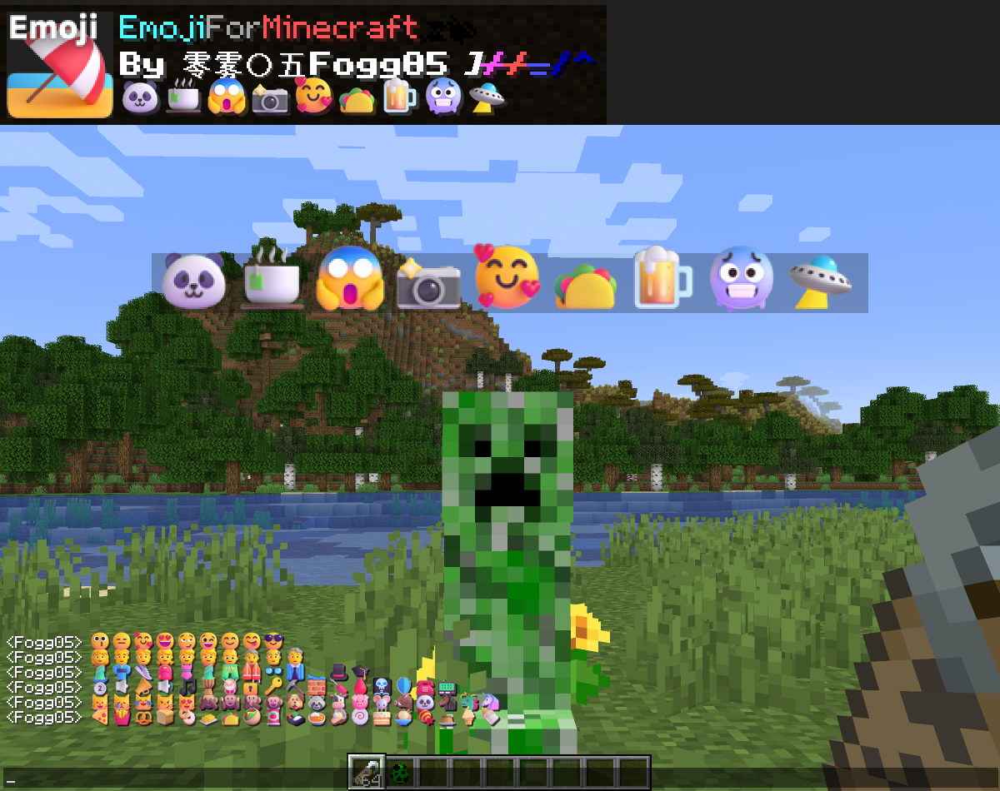

# Emoji For Minecraft

This is a Project of Minecraft Resource Pack, which replaced the Vanilla emoji in pixel style with Microsoft Fluent Emoji, covering about 1.3k frequently-used emoji.

Due to the limitations of the game's framework, I can't cover all the emojis and I've tried my best to modify them as much as possible. 🫠

# 高清Emoji

这是一个我的世界材质包，将原版像素风格的emoji替换为微软的 Fluent-Emoji ，涵盖了约1300个常用的颜文字。

受限于游戏框架，无法覆盖所有emoji，我已经尽力…… 🫠

# 如果喜欢我的作品，请务必
# 在右上角↗️给这个项目点颗星星⭐Star
# 感谢您的支持！！！🤩🤩🤩

作者B站：https://space.bilibili.com/350715147

作者网名：零雾〇五Fogg05

# 

