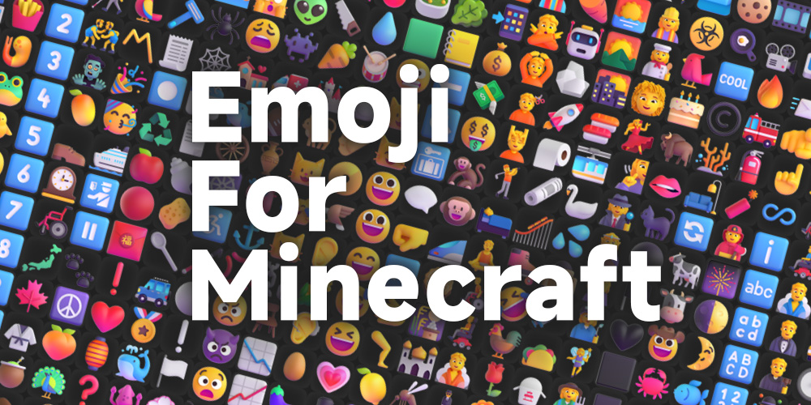
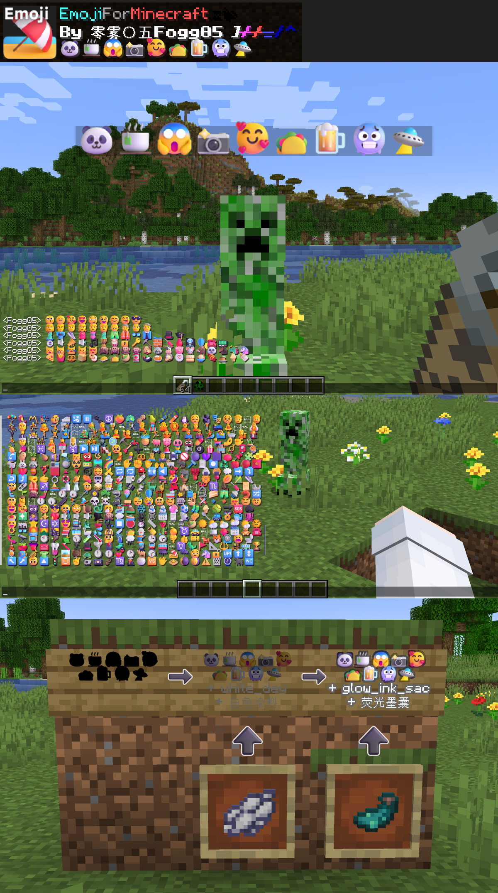

# ● Emoji For Minecraft 🏖️

# This is a Project of Minecraft Resource Pack, which replaced the Vanilla Emoji in pixel style with Microsoft Fluent Emoji, covering about 1.3k frequently-used emojis.

● Due to the limitations of the game's framework, I can't cover all the emojis.😵 And there are still some extra characters when typing some emojis which need to be deleted manually.🥶 It's easy to handle, and when you using this pack and facing with this little problem, you'll know how to deal with it, naturally.😶‍🌫️😶‍🌫️😶‍🌫️ I've tried my best to modify them as many and perfect as possible.🫠

● Remember to dye your emojis white.🎨

If you open the zip file of this pack, you'll see that there is just 2 json files and 10 png textures, but that doesn't mean it's an easy task. I have encountered unprecedented difficulties in this project, which is in a completely new field where there is no previous work to refer to. The substantial amount of emojis and the limitations of Minecraft created countless barriers and errors to my job. I had to match the tons of images with their uinicode codes, manually. (It is the fact that GPT doesn't work.) And no one could realize that 12 normal and ordinary emojis could make the entire texture pack invalidated...... 🥲🥲🥲

# 《 高清 Emoji 》🏖️

# 这是一个我的世界材质包，将原版像素风格的 emoji 替换为 微软的 Fluent-Emoji，涵盖了约 1300 个常用的颜文字。

● 受限于游戏框架，无法覆盖所有 emoji。😵 另外在输入某些 emoji 时还是会出现几个多余的字符，需要手动删除。🥶 这很容易处理，当您在游戏中遇到这个小问题时，自然而然地就会知道如何处理它。😶‍🌫️😶‍🌫️😶‍🌫️ 我已经尽力了…… 🫠

● 记得将 emoji 染成白色。🎨

如果你打开材质包的 zip 文件，你会发现它仅仅由 2 个完全相同的 json 文件和 10 张 png 贴图组成，但这并不代表这项工作十分简单。我在制作过程中我遇到了前所未有的困难，这个项目身处于一个没有已有作品可以参考借鉴的全新领域，emoji 的庞大数量和 Minecraft 的框架制造了无数的障碍和错误。我需要将数量庞大的 emoji 图片和它们的 uinicode 编码一一对应（事实证明 GPT 帮不了我），更没有人能够想到 12 个再普通不过的 emoji 能够使整个材质包失效…… 🥲🥲🥲

# 如果喜欢🥰我的作品，🙏请务必
# 在右上角↗️给这个项目点颗星星⭐Star
# 感谢您的支持！！！🤩🤩🤩

作者Ｂ站：https://space.bilibili.com/350715147

作者网名：零雾〇五Fogg05

# 

Thanks for supprot. 感谢您的支持！
